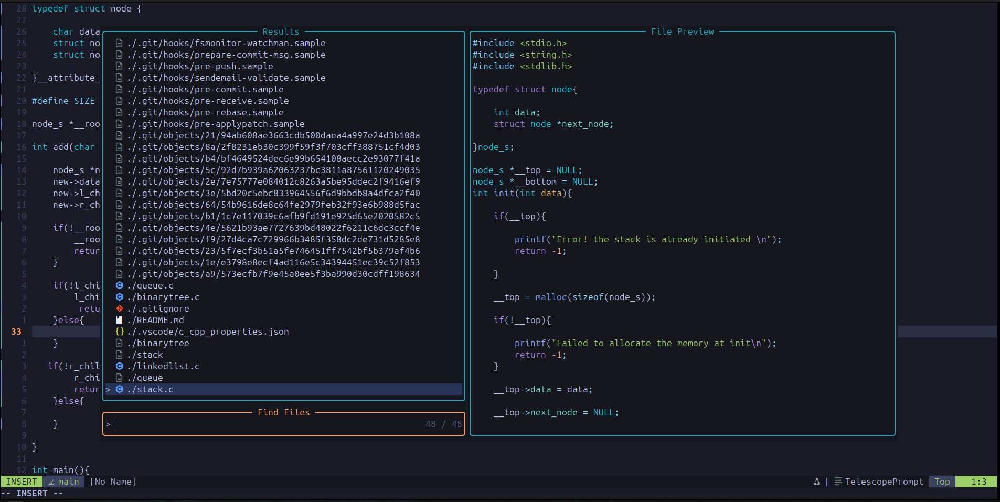

<div align="center">

# ✦ nvim

**A clean, modern Neovim config built for embedded systems development**

*Lua · lazy.nvim · LSP · Treesitter · Tokyonight*

</div>

---

## Screenshot



---

## Features

- **lazy.nvim** — fast plugin manager with lazy loading
- **LSP** via `vim.lsp.config` (nvim 0.11+ native API) — clangd, pyright, lua_ls, bashls
- **Mason** — auto-installs language servers on first launch
- **nvim-cmp** — completion with LSP, snippets, buffer, and path sources
- **Treesitter** — syntax highlighting for C, C++, Python, Lua, Bash, CMake, Devicetree, YAML and more
- **Telescope** — fuzzy finder for files, grep, and buffers
- **nvim-tree** — file explorer
- **Gitsigns** — git diff in the gutter, hunk staging
- **Lualine** — statusline with branch, diagnostics, and file info
- **Tokyonight Night** — colorscheme
- **Autopairs** — auto-close brackets and quotes
- **Neoscroll + Smear cursor** — smooth scrolling and cursor animation

---

## Structure

```
~/.config/nvim
├── init.lua                   # entry point
└── lua/conf
    ├── init.lua               # loads all modules
    ├── options.lua            # vim settings
    ├── keymap.lua             # keybindings
    ├── lazy_init.lua          # lazy.nvim bootstrap
    └── plugins/
        ├── lsp.lua            # LSP + Mason + nvim-cmp
        ├── treesitter.lua
        ├── telescope.lua
        ├── tree.lua
        ├── tokyonight.lua
        ├── lualine.lua
        ├── gitsigns.lua
        ├── autopairs.lua
        ├── neoscroll.lua
        └── smear.lua
```

---

## Requirements

- **Neovim** >= 0.11
- **git**
- **ripgrep** — for Telescope live grep (`sudo apt install ripgrep`)
- **make** — for telescope-fzf-native
- A [Nerd Font](https://www.nerdfonts.com/) in your terminal for icons

---

## Install

> ⚠️ Back up any existing config first.

```bash
mv ~/.config/nvim ~/.config/nvim.bak

git clone https://github.com/<your-username>/<your-repo>.git ~/.config/nvim
```

Open Neovim — lazy.nvim bootstraps itself and installs all plugins automatically.  
Mason then downloads clangd, pyright, lua_ls, and bashls in the background.

---

## LSP servers

| Server | Language |
|--------|----------|
| clangd | C / C++ |
| pyright | Python |
| lua_ls | Lua |
| bashls | Bash |

For STM32 / embedded C projects, drop a `compile_commands.json` in the project root and clangd picks up cross-compile flags and include paths automatically.

```bash
# CMake projects
cmake -DCMAKE_EXPORT_COMPILE_COMMANDS=ON ..
```

---

## Keybindings

Leader key = `Space`

### Files & search

| Key | Action |
|-----|--------|
| `<leader>ff` | Find files |
| `<leader>fg` | Live grep |
| `<leader>fb` | Open buffers |
| `<leader>e` | Toggle file tree |
| `<leader>w` | Save file |
| `<leader>q` | Quit |

### LSP

| Key | Action |
|-----|--------|
| `gd` | Go to definition |
| `gr` | Go to references |
| `gI` | Go to implementation |
| `K` | Hover documentation |
| `<leader>rn` | Rename symbol |
| `<leader>ca` | Code action |
| `<leader>d` | Show diagnostic |
| `[d` / `]d` | Prev / next diagnostic |

### Git (gitsigns)

| Key | Action |
|-----|--------|
| `]h` / `[h` | Next / prev hunk |
| `<leader>hs` | Stage hunk |
| `<leader>hr` | Reset hunk |
| `<leader>hp` | Preview hunk |
| `<leader>hb` | Blame line |

### Windows

| Key | Action |
|-----|--------|
| `Ctrl-h/l/j/k` | Navigate splits |
| `Ctrl-d / Ctrl-u` | Scroll down / up (centred) |

---

## Plugin manager

```
:Lazy          — open plugin dashboard
:Lazy update   — update all plugins
:Mason         — manage LSP servers
:TSInstall     — install a treesitter parser
```

---

<div align="center">
<sub>Built from scratch — no distro, no bloat.</sub>
</div>
